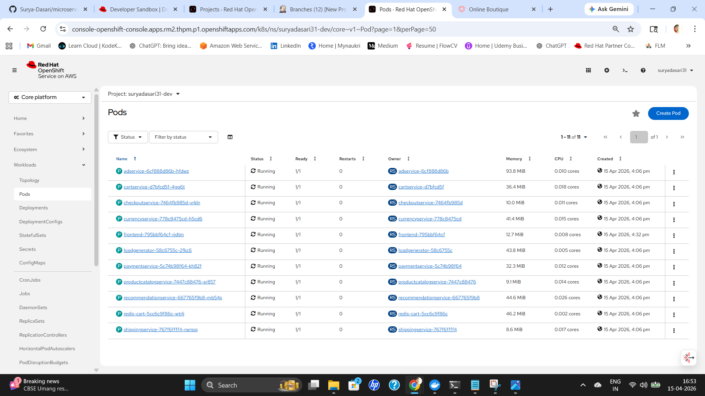
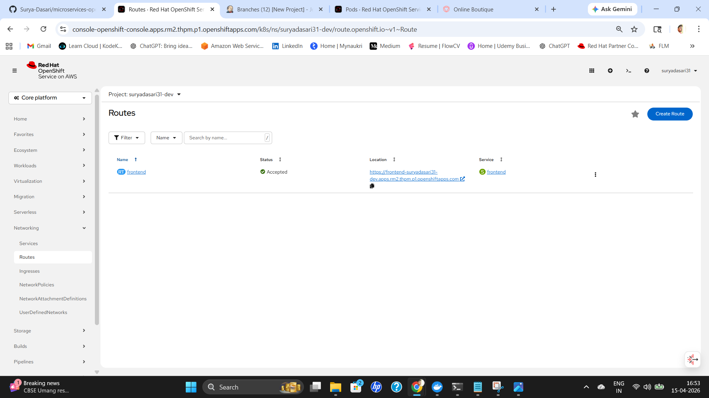
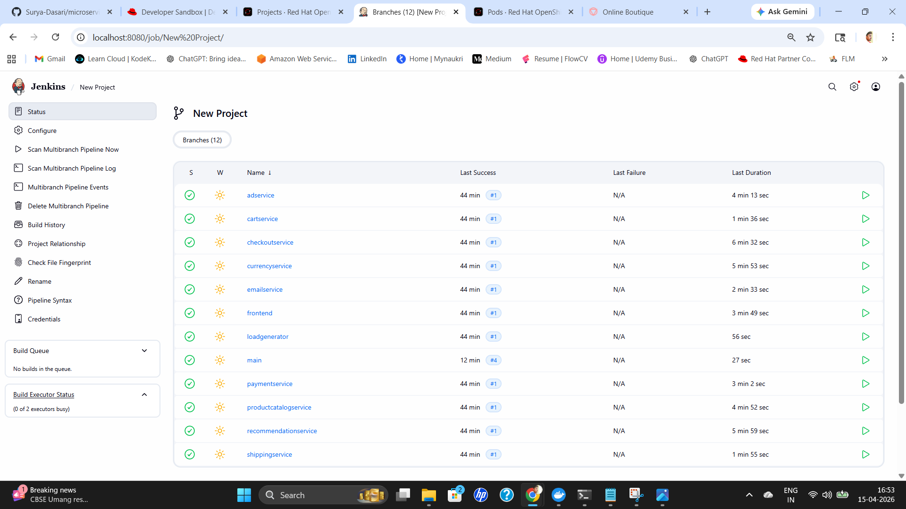

## Project Migration: EKS to OpenShift

### Overview

This project demonstrates migrating a microservices-based application from Amazon EKS to OpenShift Sandbox. The objective was to deploy the same application without modifying any application code, making only the required infrastructure and platform-level changes.

The approach follows standard DevOps practices where the application remains unchanged and only the deployment and pipeline are adapted.

---

### Architecture

EKS setup (original)

Client → LoadBalancer / NodePort → Service → Pod

OpenShift setup (final)

Client → Route → Service (ClusterIP) → Pod

---

### What was done

* Cloned the existing microservices repository
* Created a clean local workspace and synced with remote
* Updated deployment configuration for OpenShift compatibility
* Modified Jenkins pipeline for OpenShift
* Deployed using oc CLI
* Verified end-to-end access via OpenShift Route

---

### Infrastructure changes from EKS to OpenShift

Service exposure

In EKS, services were exposed using NodePort and LoadBalancer. OpenShift Sandbox uses Route instead.

Changes made:

* Removed NodePort and LoadBalancer
* Converted services to ClusterIP
* Added Route for external access

---

Networking adjustments

OpenShift uses an internal router.

Changes made:

* Ensured correct port mapping (service to container)
* Used named port (http) for route binding
* Validated routing path: Route → Service → Pod

---

Platform-specific cleanup

The original config included Istio-specific settings.

Changes made:

* Removed Istio-related annotation from frontend

Reason:
Service mesh is not available in OpenShift Sandbox, and it caused routing issues.

---

### Issues faced and resolution

Application not accessible via route

Pods were running and route existed, but UI showed "Application is not available".

Cause:
Incorrect route to service port mapping.

Fix:
Recreated route with correct port binding and configuration.

---

Frontend service missing

Route existed but no response.

Cause:
Frontend service was not properly created.

Fix:
Added correct ClusterIP service definition.

---

Port-forward working but route failing

Application worked locally but not via external URL.

Cause:
Routing layer mismatch and incorrect port reference.

Fix:
Recreated route using correct port name and ensured proper linkage.

---

Git sync issues

Faced merge conflicts and inconsistent deployments.

Cause:
Local and remote repositories were out of sync.

Fix:
Reset local repository to match remote and cleaned workspace.

---

### Jenkins pipeline changes

Original pipeline (EKS):

* Used kubectl
* Connected to EKS cluster
* Applied manifests to webapps namespace

Updated pipeline (OpenShift):

* Replaced kubectl with oc
* Added OpenShift login using token
* Switched to correct namespace
* Used oc apply for deployment

---

### Key learnings

* OpenShift uses Route instead of LoadBalancer
* Service port naming is critical for routing
* Avoid platform-specific configs unless required
* Maintain GitHub as single source of truth
* Debug in layers: Pod → Service → Route

---

### Final outcome

* All microservices deployed successfully on OpenShift
* Application accessible via Route
* Jenkins pipeline working with OpenShift
* Clean and consistent deployment achieved

---

### Application URL

https://frontend-suryadasari31-dev.apps.rm2.thpm.p1.openshiftapps.com

---

### Screenshots

#### Application UI (OpenShift Route)

#### OpenShift Pods (All Running)

#### OpenShift Route Configuration

#### Jenkins Pipeline Execution

---
### Conclusion

This project successfully demonstrates the migration of a microservices application from EKS to OpenShift by making only infrastructure-level changes without modifying application code.

The deployment was validated end-to-end, including service exposure using OpenShift Routes and CI/CD integration through Jenkins. All components were verified to be running and accessible.

This exercise highlights the importance of understanding platform-specific networking and deployment differences while maintaining consistency through version control and automation.

Overall, the project reflects practical experience in Kubernetes, OpenShift, and DevOps workflows, including troubleshooting, pipeline integration, and environment migration.

